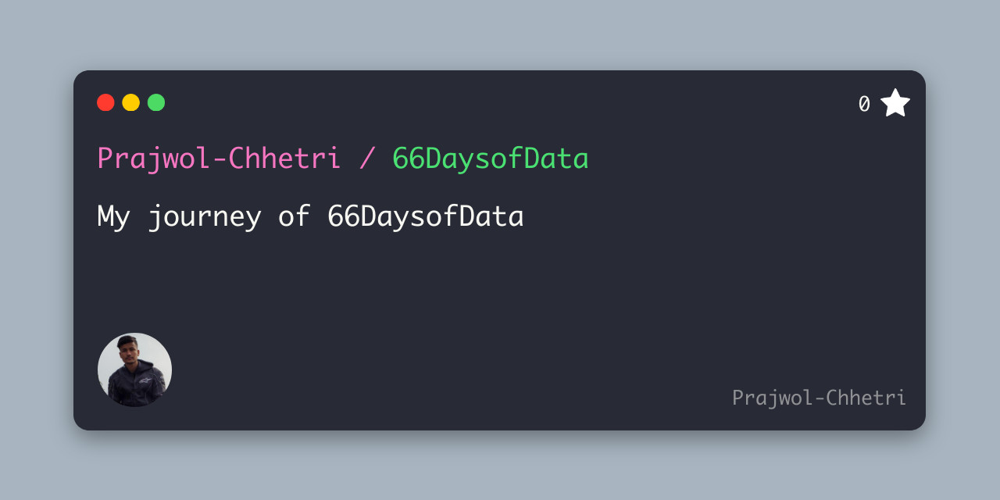
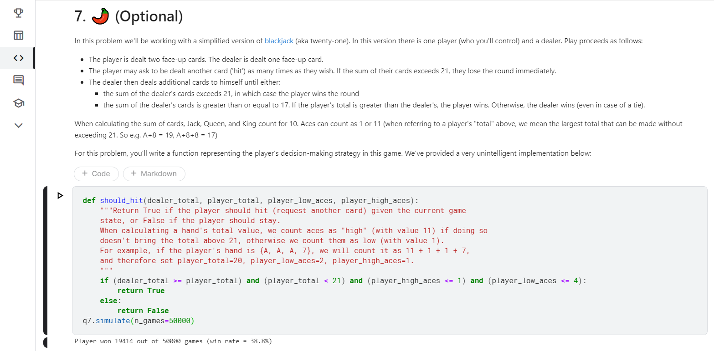
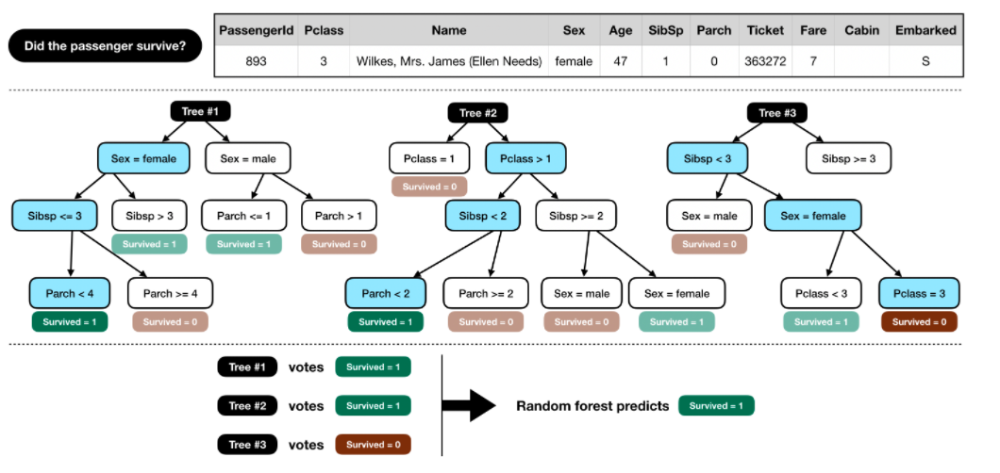
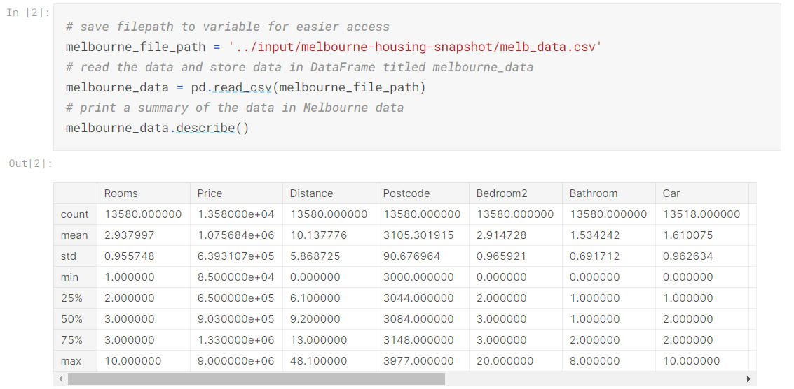

# 66DaysofData

| Resources |
| ----- |
| 1. [**Kaggle**](https://www.kaggle.com/learn) |

**Day1 of 66DaysOfData :books:**
- **Python:** On my first day of #66DaysofData I revised the basics of python for a fresh start even though I had experience on python. Today I read about various datatypes in python such as booleans, lists, strings, tuples. I also learned about loops and list comprehensions and completed all the exercises on these topics. The Python tutorial along with exercises on kaggle helped me to broaden my knowledge. I hope you will also spend some time learning the topics below. Excited on my journey ahead!!
- **Topics:**
  - Python syntax, variable assignment and numbers
  - Functions
  - Booleans and Conditionals
  - Lists
  - Loops and List Comprehensions

**Day2 of 66DaysOfData :books:**
- **Python:** On my second day of #66DaysofData I learned about strings and dictionaries and their various methods. I also learned about how to work with external libraries in Python. I also did a fun exercise which introduced me to machine learning at the end of the session. I classified the data of people in the Titanic and identified those who had highest chance of survival through random forest model. I hope you will also spend some time learning the topics below. Excited on my journey ahead!!
- **Topics:**
  - strings and dictionaries
  - Working with External Libraries
  - Titanic Tutorial

**Day3 of 66DaysOfData :books:**
- **Intro to Machine Learning:** On my third day of #66DaysofData I learned about how models are used and how they work in machine learning. I learned about decision tree model and also learned how to improve it. I understoood different terminologies used in the model. Than, I learned how to explore data by using pandas library. I understood the concept of DataFrame and interpreted the data description. I hope you will also spend some time learning the topics below. Excited on my journey ahead!!
- **Topics:**
  - How Models Work
  - Basic Data Exploration 

