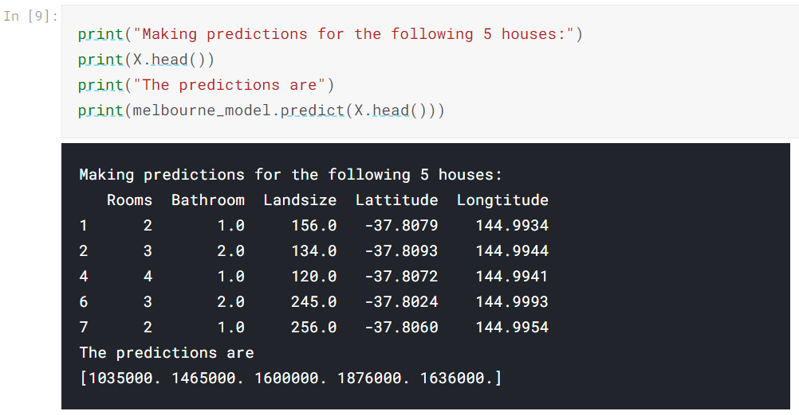
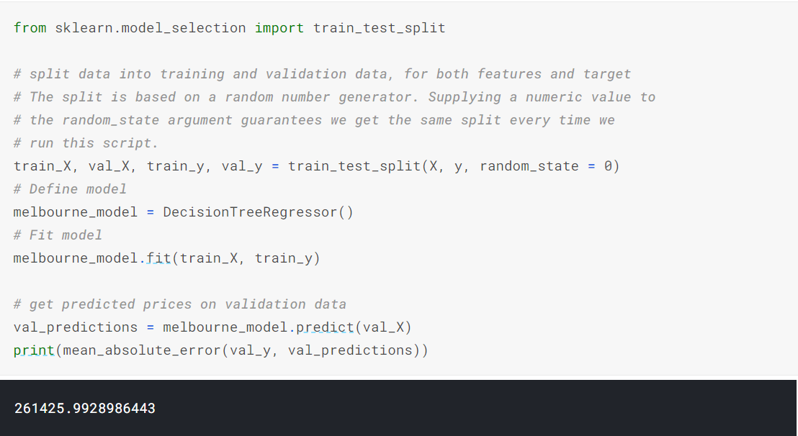
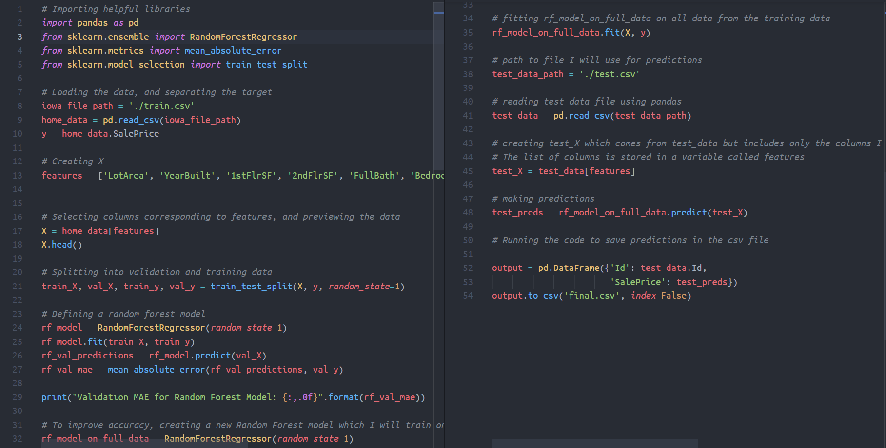
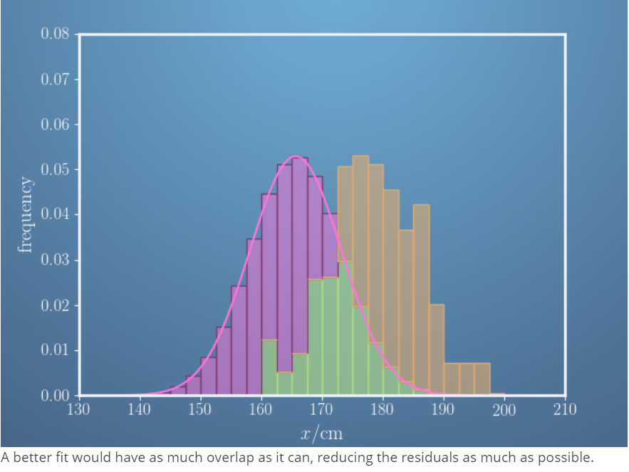

# 66DaysofData

| Resources |
| ----- |
| 1. [**Kaggle**](https://www.kaggle.com/learn) |

**Day 1 of 66DaysOfData :books:**
- **Python:** On my first day of #66DaysofData I revised the basics of python for a fresh start even though I had experience on python. Today I read about various datatypes in python such as booleans, lists, strings, tuples. I also learned about loops and list comprehensions and completed all the exercises on these topics. The Python tutorial along with exercises on kaggle helped me to broaden my knowledge. I hope you will also spend some time learning the topics below. Excited on my journey ahead!!
- **Topics:**
  - Python syntax, variable assignment and numbers
  - Functions
  - Booleans and Conditionals
  - Lists
  - Loops and List Comprehensions

**Day2 of 66DaysOfData :books:**
- **Python:** On my second day of #66DaysofData I learned about strings and dictionaries and their various methods. I also learned about how to work with external libraries in Python. I also did a fun exercise which introduced me to machine learning at the end of the session. I classified the data of people in the Titanic and identified those who had highest chance of survival through random forest model. I hope you will also spend some time learning the topics below. Excited on my journey ahead!!
- **Topics:**
  - strings and dictionaries
  - Working with External Libraries
  - Titanic Tutorial

**Day3 of 66DaysOfData :books:**
- **Intro to Machine Learning:** On my third day of #66DaysofData I learned about how models are used and how they work in machine learning. I learned about decision tree model and also learned how to improve it. I understoood different terminologies used in the model. Than, I learned how to explore data by using pandas library. I understood the concept of DataFrame and interpreted the data description. I hope you will also spend some time learning the topics below. Excited on my journey ahead!!
- **Topics:**
  - How Models Work
  - Basic Data Exploration 

**Day4 of 66DaysOfData :books:**
- **Intro to Machine Learning:** On my fourth day of #66DaysofData I learned how to design a machine learning model. I also designed my first machine learning model using scikit learn library. I trained the model and evaluated its predictions. I hope you will also spend some time learning the topics below. Excited on my journey ahead!!
- **Topics:**
  - My First Machine Learning Model

**Day5 of 66DaysOfData :books:**
- **Intro to Machine Learning:** On my fifth day of #66DaysofData I learned to measure the model quality using Mean Absolute Error also known as MAE. I also understood the common problem of comparing predictions of training data to target values in training data and also understood the concept of splitting data into training and testing data. I hope you will also spend some time learning the topics below. Excited on my journey ahead!!
- **Topics:**
  - Model Validation

**Day6 of 66DaysOfData :books:**
- **Intro to Machine Learning:** On my sixth day of #66DaysofData I completed my course on Intro to Machine Learning by Kaggle. Today I learned about the concept of Underfitting and Overfitting in machine learning models and how to find a sweet spot between them using MAE. I also learned about a new machine learning model known as Random Forests which is better than decision tree model. Finally I completed an assignment by working with Random Forests model. I hope you will also spend some time learning the topics below. Excited on my journey ahead!!
- **Topics:**
  - Underfitting and Overfitting
  - Random Forests
  - Machine Learning Competitions
  - Intro to AutoML

**Day7 of 66DaysOfData :books:**
- **Mathematics for Machine Learning: Linear Algebra:** On my seventh day of #66DaysofData I learned a bit about Linear Algebra. I decided to build a good foundation on Mathematics as it is very important to understand the logic behind the machine learning models. Today I learned about associative natures of vectors, vector addition, subtraction, scalar multiplication and different techniques to solve linear equations. I also understood about SSR. Excited on my journey ahead!!
- **Topics:**
  - Introduction to Linear Algebra and Mathematics for Machine Learning

